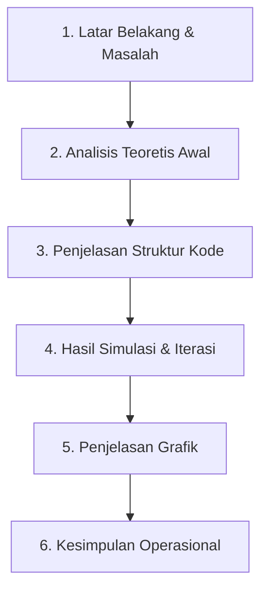

#MATAKULIAH METNUM

# Panduan Presentasi & Penjelasan Program: Simulasi Auto-Scaling pada Load Balancer

Dokumen ini disusun sebagai naskah panduan (*script*) untuk membantu Anda mempresentasikan program simulasi metode numerik Regula Falsi secara runtut, jelas, dan profesional. 

---

## 📋 Struktur Presentasi

Berikut adalah urutan penjelasan saat presentasi di depan dosen atau audiens:

---

## 🎙️ Naskah Presentasi (Langkah demi Langkah)

### Bagian 1: Latar Belakang & Rumusan Masalah
* **Tujuan**: Menjelaskan masalah nyata di dunia *backend engineering* yang diselesaikan dengan metode numerik.
* **Naskah Anda**:
  > *"Selamat pagi/siang Bapak/Ibu Dosen dan teman-teman sekalian. Hari ini saya akan mempresentasikan simulasi sistem Auto-Scaling pada Load Balancer menggunakan metode numerik Regula Falsi.*
  > 
  > *Sebagai latar belakang, sebuah server sering kali mengalami overload atau down apabila menerima beban trafik di luar kapasitasnya. Oleh karena itu, kita memodelkan fungsi latensi jaringan f(n) (dalam milidetik) terhadap jumlah request n (dalam ribuan) sebagai berikut:*
  > 
  > $$f(n) = n^3 - 5n^2 + 10n - 20$$
  > 
  > *Tujuan kita adalah mencari 'titik kritis', yaitu akar persamaan di mana f(n) = 0. Titik ini merupakan batas maksimal beban sebelum latensi melonjak drastis, sehingga sistem Auto-Scaling harus segera memicu penambahan server baru sebelum titik ini terlewati."*

---

### Bagian 2: Analisis Teoretis Awal (Analisis Interval)
* **Tujuan**: Membuktikan secara matematika mengapa pencarian akar dimulai dari interval $[3, 4]$.
* **Naskah Anda**:
  > *"Sebelum masuk ke kode program, saya melakukan estimasi awal dengan mencoba nilai n dari 0 hingga 5 untuk menemukan tanda fungsi yang berlawanan:*
  > * $f(0) = -20$ (negatif)
  > * $f(3) = -8$ (negatif)
  > * $f(4) = 4$ (positif)
  > * $f(5) = 30$ (positif)
  > 
  > *Berdasarkan **Teorema Nilai Antara (Intermediate Value Theorem)**, karena nilai f(3) bertanda negatif dan f(4) bertanda positif (terjadi perubahan tanda dari negatif ke positif), maka akar persamaan f(n) = 0 dijamin berada di dalam interval [3, 4]. Oleh karena itu, saya menetapkan batas bawah xl = 3.0 dan batas atas xu = 4.0 sebagai tebakan awal algoritma."*

---

### Bagian 3: Penjelasan Kode Program (Python & Jupyter)
* **Tujuan**: Menjelaskan logika di balik baris kode utama agar audiens paham Anda mengerti kodenya.
* **Naskah Anda**:
  > *"Mari kita bedah program Python yang saya buat. Kodenya saya rancang sesederhana mungkin (less code, better quality) dengan komponen utama sebagai berikut:*
  > 
  > * **Pertama**, fungsi `f(n)` merepresentasikan persamaan polinomial latensi kita: `n**3 - 5*n**2 + 10*n - 20`.
  > * **Kedua**, fungsi `regula_falsi(xl, xu, toleransi)` yang bertugas mencari akar secara iteratif.
  > 
  > *Di dalam fungsi regula_falsi, pada setiap perulangan saya menghitung perkiraan akar baru `xr` menggunakan rumus posisi palsu:*
  > 
  > `xr = xu - (f(xu) * (xl - xu)) / (f(xl) - f(xu))`
  > 
  > *Rumus ini memanfaatkan kemiringan garis lurus (secan) yang menghubungkan titik f(xl) dan f(xu) untuk mendekati akar asli secara lebih presisi daripada membagi dua interval secara mentah seperti metode Bisection.*
  > 
  > *Kriteria berhenti program diatur menggunakan kondisi `if abs(fxr) < toleransi: break`. Ini berarti iterasi akan berhenti saat nilai fungsi pada hampiran akar sudah sangat dekat dengan nol. Setelah itu, interval diperbarui berdasarkan tanda perkalian f(xl) * f(xr) untuk mengurung akar baru."*

---

### Bagian 4: Hasil Simulasi & Analisis Iterasi
* **Tujuan**: Menjelaskan hasil eksekusi program dan membandingkan dampak perubahan toleransi galat ($\epsilon$).
* **Naskah Anda**:
  > * saya menjalankan simulasi dengan dua skenario toleransi galat yang berbeda untuk menganalisis efisiensi algoritma:*
  > 
  > * **Skenario 1 (Toleransi $\epsilon = 10^{-6}$)**:
  >   * *Program berhasil menemukan akar pada iterasi ke-8.*
  >   * *Nilai akar yang didapat adalah n = 3.75530715.*
  > 
  > * **Skenario 2 (Toleransi $\epsilon = 10^{-9}$)**:
  >   * *Program berhasil menemukan akar pada iterasi ke-11.*
  >   * *Nilai akar yang didapat adalah n = 3.755307153.*
  > 
  > *Analisis penting di sini adalah: ketika kita memperketat tingkat ketelitian sebanyak 1000 kali lipat (dari $10^{-6}$ menjadi $10^{-9}$), jumlah iterasi hanya bertambah 3 kali saja (dari 8 menjadi 11). Ini menunjukkan bahwa metode Regula Falsi sangat efisien dan memiliki laju konvergensi yang cepat dalam menyelesaikan model latensi jaringan ini."*

---

### Bagian 5: Penjelasan Grafik Visualisasi (`matplotlib`)
* **Tujuan**: Menjelaskan kurva visual dan arti dari representasi grafik.
* **Naskah Anda**:
  > *"Untuk mempermudah pemahaman tim backend, saya memvisualisasikan model matematika ini ke dalam grafik 2 dimensi menggunakan pustaka matplotlib.*
  > 
  > * Garis kurva berwarna biru menunjukkan pergerakan latensi jaringan f(n). Kita bisa melihat kurva naik secara non-linear seiring bertambahnya jumlah request.
  > * Garis putus-putus hitam horizontal merupakan batas f(n) = 0.
  > * Titik merah tebal yang berada tepat di perpotongan kurva dengan sumbu-x adalah lokasi akar atau titik kritis yang kita cari, yaitu pada koordinat (3.755307, 0)."*

---

### Bagian 6: Kesimpulan Operasional Server (Koneksi ke Backend)
* **Tujuan**: Menunjukkan pemahaman mendalam tentang bagaimana angka numerik dihubungkan ke operasional server riil.
* **Naskah Anda**:
  > *"Dari hasil simulasi ini, apa kesimpulan operasional yang dapat diambil?*
  > 
  > * Nilai akar n ≈ 3.755307 dalam satuan ribuan berarti titik kritis sistem berada pada **3.755 request**.
  > * Jika beban trafik menyentuh angka 3.755 request, latensi jaringan akan mencapai titik kritis (latensi meningkat tajam).
  > * **Rekomendasi Aksi**: Sistem Auto-Scaling pada Load Balancer harus dikonfigurasi untuk mendeteksi beban ini dan memicu penambahan (*scale-up*) server baru sebelum trafik mencapai 3.755 request (misalnya, membuat threshold peringatan di angka 3.000 atau 3.500 request).
  > 
  > *Demikian presentasi dari saya mengenai simulasi penentuan titik kritis load balancer ini. Terima kasih atas perhatiannya, saya persilakan jika ada pertanyaan dari Bapak/Ibu Dosen atau teman-teman sekalian."*

---

## 💡 Tips Tambahan untuk Demo Program
Saat mendemokan program secara langsung:
1. **Jalankan Sel 1 & 2**: Tunjukkan tabel iterasi yang tercetak rapi ke layar. Sebutkan bahwa nilai `f(xr)` di kolom paling kanan terus mengecil menuju angka nol (e.g. pangkat negatif semakin besar seperti `e-05`, `e-06`, dst).
2. **Jalankan Sel 3**: Tunjukkan grafik visualisasi. Arahkan kursor Anda ke titik merah dan jelaskan bahwa titik tersebut adalah letak persis server harus melakukan scale-up.
