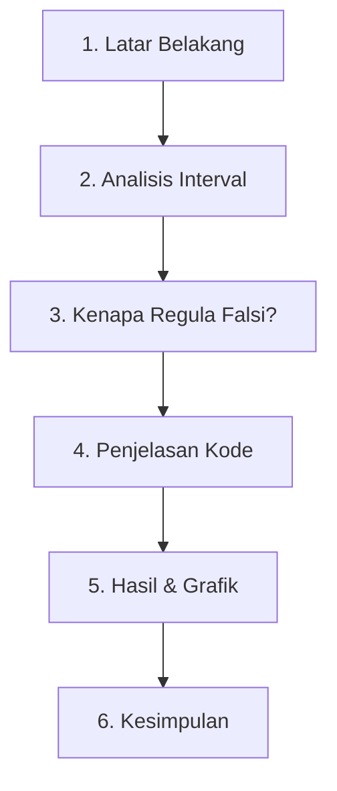

# MATAKULIAH METNUM

# Script Presentasi: Simulasi Auto-Scaling pada Load Balancer

Script buat dibaca saat presentasi. Ikutin aja alurnya dari atas ke bawah.

---

## 📋 Alur Presentasi

---

## 🎙️ Script Presentasi

### 1. Latar Belakang

> *"Selamat pagi/siang Bapak/Ibu Dosen dan teman-teman. Hari ini saya akan presentasi tentang simulasi Auto-Scaling pada Load Balancer pakai metode Regula Falsi.*
>
> *Jadi konteksnya gini — sebagai Backend Developer, menjaga ketersediaan layanan itu prioritas utama. Server itu rentan down kalau terima request di luar kapasitasnya. Makanya, kita modelkan fungsi latensi jaringan sebagai persamaan polinomial:*
>
> $$f(n) = n^3 - 5n^2 + 10n - 20$$
>
> *Dimana `n` itu jumlah request dalam ribuan, dan `f(n)` itu latensi dalam milidetik.*
>
> *Tujuannya? Kita mau cari **titik kritis** — yaitu titik di mana f(n) = 0. Di titik ini, sistem Auto-Scaling harus langsung trigger penambahan server baru sebelum latensi melonjak dan bikin downtime."*

---

### 2. Analisis Interval

> *"Sebelum masuk kode, kita estimasi dulu interval akarnya. Saya coba masukkan nilai n dari 0 sampai 5:*
>
> | n | f(n) | Tanda |
> |---|------|-------|
> | 0 | -20  | ➖    |
> | 3 | -8   | ➖    |
> | 4 | 4    | ➕    |
> | 5 | 30   | ➕    |
>
> *Dari sini keliatan — antara n=3 dan n=4 terjadi **perubahan tanda** dari negatif ke positif. Artinya berdasarkan Teorema Nilai Antara, akar pasti ada di interval [3, 4].*
>
> *Jadi kita set batas bawah `xl = 3.0` dan batas atas `xu = 4.0` sebagai tebakan awal."*

---

### 3. Kenapa Regula Falsi?

> *"Nah kenapa pakai Regula Falsi, bukan cuma baca grafik manual? Tiga alasan utama:*
>
> 1. **Konvergensi cepat** — Regula Falsi pakai interpolasi linear lewat garis sekan buat proyeksi akar secara iteratif. Jauh lebih cepat daripada metode grafis yang spekulatif.
>
> 2. **Presisi tinggi** — Kita bisa set toleransi galat sampai 10⁻⁶ atau bahkan 10⁻⁹, jadi hasilnya terbebas dari bias visual manusia.
>
> 3. **Cocok buat Auto-Scaling** — Beda sama metode grafis yang butuh pengawasan manual, Regula Falsi bisa jalan otomatis di background server, kasih keputusan scale-up secara real-time."*

---

### 4. Penjelasan Kode

> *"Sekarang kita bedah kodenya. Strukturnya simpel:*
>
> * **Pertama**, fungsi `f(n)` — ini representasi persamaan polinomial latensi kita: `n**3 - 5*n**2 + 10*n - 20`.
>
> * **Kedua**, fungsi `regula_falsi(xl, xu, toleransi)` yang cari akar secara iteratif.
>
> *Di dalamnya, setiap iterasi kita hitung hampiran akar baru `xr` pakai rumus posisi palsu:*
>
> `xr = xu - (f(xu) * (xl - xu)) / (f(xl) - f(xu))`
>
> *Rumus ini manfaatin kemiringan garis sekan antara titik f(xl) dan f(xu) buat mendekati akar — lebih presisi daripada metode Bisection yang cuma bagi dua interval.*
>
> * **Ketiga**, kriteria berhenti — iterasi otomatis stop saat `abs(fxr) < toleransi`, artinya nilai fungsi udah cukup dekat ke nol. Setelah itu interval diperbarui berdasarkan tanda `f(xl) * f(xr)`."*

---

### 5. Hasil & Grafik

> *"Saya jalankan simulasi dengan dua skenario toleransi:*
>
> | Skenario | Toleransi | Iterasi | Akar (n) |
> |----------|-----------|---------|----------|
> | 1 | 10⁻⁶ | 8 | 3.75530715 |
> | 2 | 10⁻⁹ | 11 | 3.755307153 |
>
> *Yang menarik — waktu kita perketat ketelitian 1.000 kali lipat (dari 10⁻⁶ ke 10⁻⁹), iterasinya cuma nambah 3 (dari 8 jadi 11). Ini bukti Regula Falsi sangat efisien buat komputasi backend.*
>
> *Untuk grafiknya — kurva biru itu pergerakan latensi f(n), naik secara non-linear seiring bertambahnya request. Garis putus-putus hitam itu batas f(n) = 0. Dan titik merah di perpotongan kurva dengan sumbu-x adalah **titik kritis** yang kita cari, yaitu di koordinat (3.755307, 0)."*

---

### 6. Kesimpulan

> *"Jadi dari simulasi ini, kesimpulannya:*
>
> * Kapasitas absolut arsitektur saat ini ada di angka **3.755 ribuan request**.
> * Kalau trafik nembus angka ini, latensi bakal melonjak fatal — alias **downtime**.
> * **Rekomendasi**: Load Balancer harus dikonfigurasi buat kirim webhook dan alokasi instance server baru **sebelum** request menyentuh 3.755 ribu. Misalnya set threshold peringatan di angka 3.000 atau 3.500 request.
>
> *Sekian presentasi dari saya. Terima kasih, silakan kalau ada pertanyaan."*

---

## 💡 Tips Saat Demo

1. **Jalankan Sel 1 & 2** — Tunjukin tabel iterasi. Highlight bahwa nilai `f(xr)` di kolom kanan terus mengecil menuju nol (pangkat negatif makin besar: `e-05`, `e-06`, dst).
2. **Jalankan Sel 3** — Tunjukin grafik. Arahin ke titik merah dan jelasin itu titik dimana server harus scale-up.
